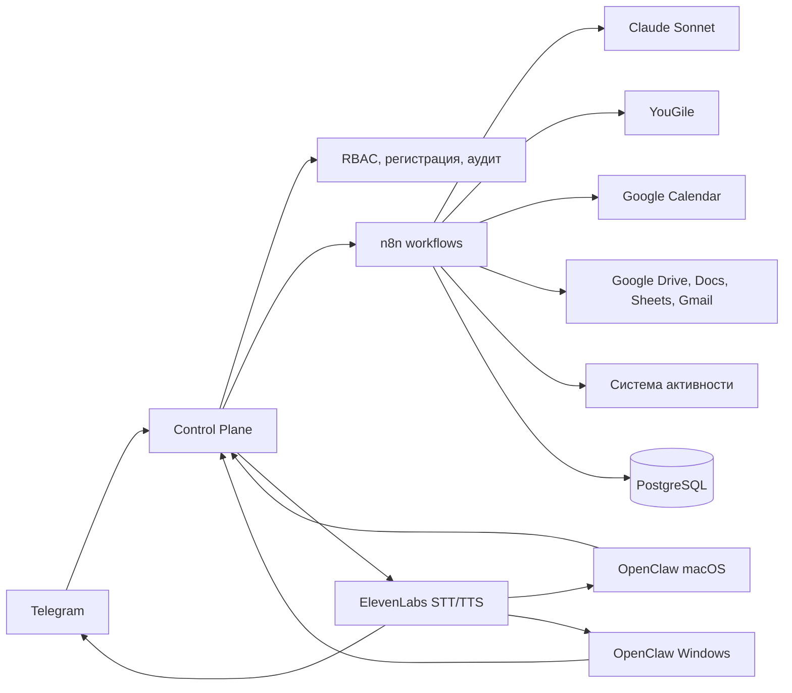

# План развития Starlab Assistant

Дата: 11 июня 2026

## 1. Целевая архитектура



Control Plane остается единой точкой авторизации, иерархии, аудита и
безопасного доступа к устройствам. n8n отвечает за понятные визуальные
сценарии, расписания и интеграции. PostgreSQL становится долговременной
памятью и источником аналитики.

Telegram не должен одновременно обрабатываться двумя независимыми webhook:
входящее сообщение принимает Control Plane, а затем передает подписанное
внутреннее событие в нужный workflow n8n.

## 2. Аварийный сброс кода Николая

Добавить отдельную роль `DEVELOPER_RECOVERY`, привязанную через переменную
окружения:

```text
DEVELOPER_TELEGRAM_IDS=984834133
```

Она не получает права владельца и не может читать отчеты сотрудников.
Разрешается только:

- посмотреть статус регистрации Николая;
- перевыпустить регистрационный код Николая;
- отозвать старые неиспользованные коды Николая.

Команда:

```text
/reset_owner_code
```

Защита:

- подтверждение второй командой с одноразовым nonce;
- срок подтверждения 5 минут;
- rate limit;
- запись в audit log;
- уведомление Николаю о перевыпуске;
- существующие устройства, Telegram и память Николая не отключаются;
- отзыв device token выполняется только отдельной командой.

## 3. Голос в Telegram

Часть функциональности уже есть: Telegram voice скачивается, ElevenLabs
Scribe v2 вызывается для STT, а ElevenLabs TTS умеет вернуть аудиофайл.

Нужно завершить:

1. Заменить опубликованный API key новым ключом и сохранить его через
   зашифрованный `/setup`.
2. Использовать `ELEVENLABS_VOICE_ID=dxhwlBCxCrnzRlP4wDeE`.
3. Ввести единый объект входящего сообщения:
   - `text`;
   - `inputMode: text|voice`;
   - `replyMode: text|voice`;
   - пользователь, устройство, язык.
4. Все ответы проводить через единый delivery service. Сейчас голосовой
   ответ гарантирован прежде всего для свободного AI-чата; команды и отчеты
   должны использовать тот же механизм.
5. Если пользователь просит "голосом", "аудио" или "войсом":
   - отправить короткую голосовую сводку;
   - полный подробный отчет оставить текстом;
   - не озвучивать таблицы и технический мусор.
6. Добавить ограничения длины, повторные попытки и учет стоимости STT/TTS.
7. Сохранять в памяти текстовую расшифровку, а не исходное аудио. Аудио
   удалять после обработки.

## 4. Голос в локальных агентах

macOS и Windows получают:

- кнопку записи;
- push-to-talk;
- отправку аудио по device-token на Control Plane;
- воспроизведение голосового ответа;
- выбор "ответить текстом" или "ответить голосом".

Новые API:

```text
POST /api/v1/local-agent/voice/transcribe
POST /api/v1/local-agent/voice/chat
POST /api/v1/local-agent/voice/synthesize
```

Секрет ElevenLabs остается только на сервере. Локальные приложения его не
получают.

## 5. Автозапуск

### Windows

Автозапуск уже включается через Electron `setLoginItemSettings`. Надо:

- проверять его после установки и после обновления;
- запускать приложение свернутым в tray;
- восстанавливать автозапуск, если обновление его потеряло;
- добавить переключатель для пользователя, оставив значение по умолчанию
  включенным.

### macOS

Использовать существующий механизм Launch at Login в OpenClaw:

- включать по умолчанию после успешной регистрации устройства;
- не менять bundle identifier;
- запускать приложение в menu bar без лишнего окна;
- сохранить возможность отключения в настройках.

## 6. Автообновление локальных агентов

### Общая схема

- каналы `stable` и `pilot`;
- проверка при запуске и каждые 6 часов;
- скачивание только по HTTPS;
- обязательная криптографическая подпись сборок;
- установка, когда нет выполняющейся device command;
- сохранение registration/device token и настроек;
- отчет версии и результата обновления на сервер;
- staged rollout: сначала разработчик, затем Максат, затем PM, затем все;
- возможность остановить плохой релиз.

Поскольку Apple Developer Account и Windows code-signing certificate пока
отсутствуют, обновления вводятся в два этапа:

1. Сначала приложение только проверяет сервер, показывает доступную версию и
   скачивает проверенный checksum-файл. Установка подтверждается пользователем.
2. Полностью автоматическая тихая установка включается только после появления
   подписей и прохождения пилотного обновления.

До этого нельзя автоматически заменять рабочее приложение неподписанной
сборкой: это может вызвать SmartScreen/Gatekeeper, потерю разрешений или
невозможность запуска.

### Windows

Подключить `electron-updater` к:

```text
https://starlabagent.pp.ua/downloads/updates/windows/
```

Публиковать:

- installer `.exe`;
- `latest.yml`;
- `.blockmap`;
- checksum и release notes.

Нужен сертификат code signing. Без подписи Windows SmartScreen и UAC могут
блокировать или пугать пользователя, а полностью бесшумное обновление
per-machine установки гарантировать нельзя.

### macOS

В OpenClaw уже подключен Sparkle. Нужно:

- заменить официальный update feed на наш `appcast.xml`;
- использовать отдельный Sparkle signing key;
- подписывать Developer ID;
- notarize сборку у Apple;
- включить автоматическую загрузку и установку;
- проверить, что обновление не меняет bundle id и Keychain access group.

До готовности собственного feed официальный feed необходимо отключить, иначе
наша сборка теоретически может обновиться официальной сборкой и потерять
корпоративную интеграцию.

Первое обновление текущих установленных агентов все равно будет ручным:
автообновлятор появится только после установки новой базовой версии.

## 7. Прием задач и подтверждение

YouGile дополняет Platrum и Bitrix, но не заменяет их:

- Platrum остается источником проектов, сотрудников и существующих показателей;
- Bitrix продолжает работать для данных, которые пока находятся только там;
- YouGile добавляется как новый источник рабочих задач;
- Google Calendar остается источником расписания и событий;
- `/tasks` формирует объединенную картину с указанием источника каждой задачи;
- `/platrum` и `/bitrix` сохраняются без изменения поведения.

Любой текст или голос сначала превращается в `Action Draft`.

Пример:

```text
Понял:
1. Создать задачу в YouGile: подготовить отчет, срок завтра 15:00.
2. Добавить блок в Google Calendar: завтра 13:00-14:00.

Подтвердить / Изменить / Отменить
```

После подтверждения:

- создается задача в YouGile и/или событие Calendar;
- сохраняются external IDs;
- повторное нажатие не создает дубль;
- действие попадает в audit log и память.

Разрешить создание и редактирование доступных пользователю объектов, но только
после подтверждения. Перед изменением бот показывает diff:

```text
Было: срок 14 июня, статус "В работе"
Станет: срок 15 июня, статус "На проверке"

Подтвердить / Изменить / Отменить
```

Подтверждение привязывается к пользователю, объекту, новой версии данных и
истекает через 10 минут. Если объект успел измениться другим человеком,
операция останавливается и создается новый черновик.

Удаление задач и событий пока остается запрещенным. Для удаления позже нужен
отдельный сценарий с двойным подтверждением.

## 8. Утренний план

n8n ежедневно рассчитывает индивидуальное рабочее окно сотрудника.

Источники:

1. Platrum: официальный график, смена, выходной, отпуск и исключения.
2. Google Calendar: рабочие календари сотрудника, встречи и явно обозначенные
   рабочие блоки.
3. Подтвержденное сотрудником рабочее окно предыдущих дней.
4. Настроенный администратором график по умолчанию как последний fallback.

Расчет не отдается целиком LLM. Отдельный `Schedule Resolver` собирает
структурированные интервалы, а AI только объясняет результат. Это защищает от
выдуманного времени.

Правила приоритета:

- отпуск, выходной или больничный в Platrum отменяет ежедневные запросы;
- явная смена Platrum задает начало и конец дня;
- рабочий Calendar может уточнить исключение на конкретный день;
- личные события, сон и календари без рабочего признака не определяют смену;
- если источники конфликтуют больше чем на 60 минут, сотруднику задается
  уточняющий вопрос;
- при низкой уверенности используется подтвержденный fallback, а не догадка.

Время сообщений:

- утренний план: через 10 минут после определенного начала работы;
- вечерний отчет: за 20 минут до определенного окончания работы;
- пример для графика 09:00-18:00: сообщения в 09:10 и 17:40.

Workflow:

1. Берет незавершенные и просроченные задачи.
2. Берет задачи из YouGile, Platrum и Bitrix без удаления дублей по названию:
   связывает их по external ID и проекту.
3. Берет рабочие события Calendar.
4. Учитывает вчерашние договоренности и блокеры.
5. Готовит черновик, а не директиву.
6. Отправляет кнопки:
   - `Все верно`;
   - `Изменить`;
   - `Не сегодня`.
7. Только после подтверждения фиксирует план дня.

Расписание пересчитывается ночью, после изменения Calendar/Platrum и за
30 минут до предполагаемого сообщения. Для защиты от повторов используется
ключ `userId + localDate + morning|evening`.

## 9. Вечерний отчет

Workflow собирает:

- какие задачи изменили статус в YouGile, Platrum и Bitrix;
- что завершено и перенесено;
- дедлайны и просрочки;
- календарные события;
- активность компьютера, если источник доступен;
- блокеры и договоренности.

Ответ состоит из:

- короткого итога;
- прогресса и эффективности;
- одного мягкого уточняющего вопроса;
- подробностей по запросу.

Если источник активности недоступен, отчет не выдумывает данные и явно
помечает неполноту.

Если окончание рабочего дня изменилось в течение дня, время вечернего отчета
пересчитывается. Уже отправленный отчет повторно не отправляется.

## 10. Долговременная память

Перенести production-память из JSON-state в PostgreSQL:

- `conversation_messages`;
- `memory_facts`;
- `employee_projects`;
- `agreements`;
- `action_drafts`;
- `task_events`;
- `daily_snapshots`;
- `weekly_metrics`;
- `meeting_briefs`;
- `workflow_runs`.

Память разделяется по пользователям и иерархии. PM не видит чужие данные,
Максат видит своих PM, Николай видит всю компанию. Локальный агент и Telegram
используют одну и ту же память.

## 11. Справка к встрече

За 20-30 минут до события Calendar n8n:

- определяет проект и участников;
- достает связанные YouGile задачи;
- показывает просрочки, последние изменения и открытые вопросы;
- при наличии прав добавляет релевантные Docs/Drive материалы;
- отправляет короткую справку участнику.

Для защиты от спама применяется idempotency key по event ID и времени
начала.

## 12. Еженедельный дайджест

Дайджест сравнивает:

- текущую неделю с предыдущей;
- текущую неделю со средним за четыре недели;
- completion rate;
- просрочки;
- переносы;
- нагрузку календаря;
- повторяющиеся блокеры;
- динамику активности.

Цель: показать тренд и точки улучшения, а не только перечислить события.

## 13. n8n workflows

Создать отдельные визуальные workflow:

1. `TG - Normalize Text and Voice`
2. `Assistant - Intent Router`
3. `Tasks - Draft and Confirm`
4. `YouGile - Create or Update`
5. `Google Calendar - Create or Update`
6. `Daily - Morning Draft`
7. `Daily - Evening Review`
8. `Schedule - Resolve Work Window`
9. `Meetings - Pre-Meeting Brief`
10. `Weekly - Trend Digest`
11. `Memory - Extract Facts`
12. `Voice - STT and TTS`
13. `Devices - Command Dispatch`
14. `Ops - Update Release Monitor`

Code nodes используются только для нормализации нестандартных данных. Ветки,
условия, API-вызовы, AI Agent, память, расписания и ошибки должны быть
отдельными блоками.

## 14. Этапы реализации

### Этап 0. Безопасность и резервная копия

- отозвать опубликованный ElevenLabs key;
- сделать backup state, n8n и PostgreSQL;
- зафиксировать текущие версии агентов;
- добавить feature flags;
- снять contract/smoke-тесты с существующих Telegram, Google, Platrum,
  Bitrix, памяти и device commands;
- запретить удаление старых маршрутов до завершения параллельной проверки.

### Этап 1. Developer recovery

- специальная команда сброса кода Николая;
- подтверждение, rate limit, audit и тесты.

### Этап 2. Telegram voice

- настроить новый ElevenLabs key и Voice ID;
- общий delivery service;
- голос для отчетов и команд;
- учет токенов и стоимости.

### Этап 3. Автозапуск и updater

- Windows updater;
- macOS Sparkle feed;
- серверные manifests;
- pilot rollout;
- до появления сертификатов оставить установку обновления подтверждаемой.

### Этап 4. YouGile и Calendar actions

- connector;
- draft/confirm;
- idempotency;
- optimistic concurrency для редактирования;
- запрет удаления;
- объединенный read-only `/tasks`, не меняющий `/platrum` и `/bitrix`.

### Этап 5. Память и ежедневные workflows

- PostgreSQL memory;
- утренний план;
- вечерний отчет;
- миграция старой памяти.

### Этап 6. Встречи и недельная аналитика

- meeting brief;
- snapshots;
- weekly trends.

### Этап 7. Локальный голос и production rollout

- macOS/Windows microphone UI;
- voice chat;
- нагрузочные и security-тесты;
- постепенное обновление сотрудников.

## 15. Возможные регрессии

Ничего намеренно удалять не планируется. Возможны следующие проблемы:

- Google OAuth: для записи Calendar понадобятся дополнительные scopes, поэтому
  сотрудники могут быть обязаны один раз переподключить Google.
- macOS: смена bundle id, подписи или Keychain group потеряет локальную
  регистрацию. Эти значения нельзя менять.
- Windows: unsigned installer/update может блокироваться SmartScreen.
- Auto-update: плохой релиз может обновить сразу всех. Нужны pilot channel и
  staged rollout.
- Telegram: два webhook или два активных workflow создадут двойные ответы.
- YouGile: без idempotency возможно создание дублей.
- Голос: длинные отчеты увеличивают стоимость и плохо воспринимаются. Поэтому
  голосом отправляется краткая версия, текстом полная.
- RBAC: общая память без фильтрации может раскрыть данные между PM. Все memory
  queries проходят через Control Plane policy.
- Планировщики: старые и новые n8n jobs могут присылать двойные утренние или
  вечерние сообщения. Старые jobs отключаются только после smoke-теста новых.
- Текущие агенты: не получат автообновление, пока один раз вручную не будет
  установлена версия с updater.
- `/bitrix` и `/platrum`: YouGile их дополняет. Команды и старые коннекторы
  сохраняются, а объединенный `/tasks` добавляется отдельно.
- Система активности: если Metricon или его замена недоступны, эффективность
  будет считаться только по задачам и календарю.
- Расписание: Calendar с личными событиями может дать неверное начало дня.
  Учитываются только рабочие календари и подтвержденные типы событий, а при
  конфликте бот уточняет время.
- Редактирование: объект может измениться после показа подтверждения. Перед
  записью повторно проверяется версия объекта.

## 16. Стратегия сохранения уже работающих функций

1. Новые функции закрываются feature flags:
   - `YOUGILE_ENABLED`;
   - `DYNAMIC_SCHEDULE_ENABLED`;
   - `VOICE_DELIVERY_V2_ENABLED`;
   - `DESKTOP_AUTO_UPDATE_ENABLED`.
2. По умолчанию flags выключены на production.
3. Первый запуск выполняется в shadow mode: система рассчитывает результат,
   но не отправляет и не записывает данные.
4. Результат сравнивается с текущей логикой и логируется без персональных
   секретов.
5. Затем функция включается для Telegram ID разработчика.
6. После smoke-теста включается для Максата.
7. Затем для одного PM и только потом для всех.
8. Для каждого этапа есть rollback только переключением flag, без отката БД.
9. Миграции БД только additive: новые таблицы и столбцы, без удаления старых.
10. Старые state-файлы и workflows сохраняются до двух успешных недель работы.
11. Перед каждым release создается backup и фиксируется версия сборки.
12. Новый updater не устанавливает релиз, пока агент выполняет device command.

## 17. Утвержденные решения

1. YouGile дополняет Platrum и Bitrix.
2. Voice ID: `dxhwlBCxCrnzRlP4wDeE`.
3. Утренний запрос отправляется через 10 минут после начала рабочего дня.
4. Вечерний запрос отправляется за 20 минут до окончания рабочего дня.
5. Рабочее окно вычисляется по Platrum и рабочим Google Calendar.
6. Создание и редактирование разрешены только после подтверждения.
7. Удаление пока запрещено.
8. Apple Developer Account отсутствует.
9. Windows code-signing certificate отсутствует.

## 18. Оставшиеся уточнения

1. Какие поля/разделы Platrum содержат официальный график и исключения?
2. Какие Google-календари считать рабочими и кто их отмечает?
3. Какой пользователь и API token YouGile будут использоваться?
4. Какой fallback-график использовать, когда Platrum и Calendar пусты?

## 19. Оценка

- рабочий MVP: 6-9 рабочих дней;
- production-вариант с памятью, updater, подписями, пилотом и аналитикой:
  14-20 рабочих дней;
- ожидание Apple/Windows сертификатов и доступов не входит в срок.
